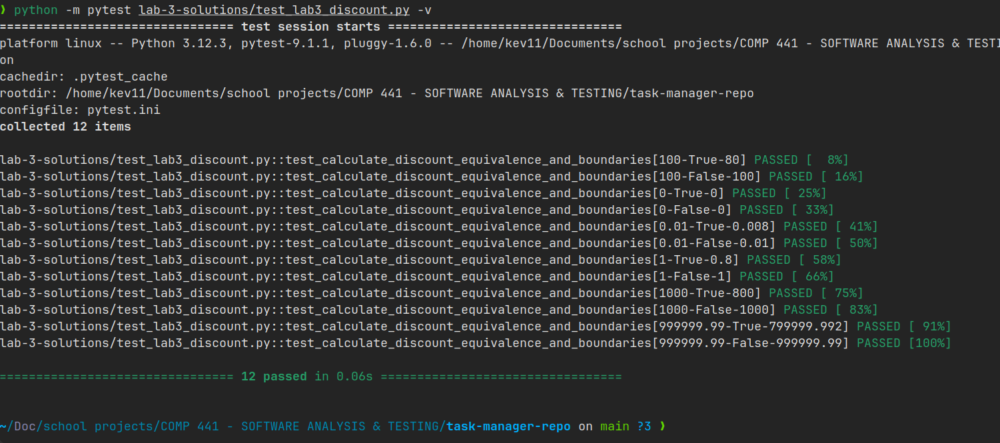

# COMP 441 — Lab 3: Dynamic Analysis & Test Design Techniques

## 1. Objective

This lab applies dynamic analysis, Equivalence Partitioning (EP), and Boundary Value Analysis (BVA) to the supplied `calculate_discount()` function.

The objectives were to:

- identify input variables and their relevant domains;
- derive equivalence partitions;
- identify boundary and edge cases;
- design at least ten test cases;
- implement the test cases using PyTest;
- execute the tests against the supplied implementation;
- identify any defects revealed by testing; and
- compare manually designed tests with AI-generated test cases.

---

## 2. Target Function

The function selected for testing was:

```python
def calculate_discount(price, is_premium):
    """Apply a loyalty discount for premium users."""
    if is_premium == True:
        return price * 0.8
    else:
        return price
```

The function applies a 20% discount when `is_premium` is `True`; otherwise, it returns the original price.

---

## 3. Equivalence Partitioning

| Partition | Input condition | Expected behaviour |
|---|---|---|
| EP1 | `is_premium = True` | Price is multiplied by `0.8` |
| EP2 | `is_premium = False` | Original price is returned |

The implementation does not explicitly validate input types. Invalid types were therefore treated as exploratory cases rather than assumed requirements.

---

## 4. Boundary and Edge Cases

| Test ID | Price | Premium | Expected | Technique |
|---|---:|:---:|---:|---|
| BVA-01 | 0 | True | 0 | Boundary |
| BVA-02 | 0 | False | 0 | Boundary |
| BVA-03 | 0.01 | True | 0.008 | Boundary |
| BVA-04 | 0.01 | False | 0.01 | Boundary |
| EC-01 | 1 | True | 0.8 | Edge |
| EC-02 | 1 | False | 1 | Edge |
| EC-03 | 1000 | True | 800 | Edge |
| EC-04 | 1000 | False | 1000 | Edge |
| EC-05 | 999999.99 | True | 799999.992 | Edge |
| EC-06 | 999999.99 | False | 999999.99 | Edge |

These cases exercise both logical branches and a range of numerical inputs.

---

## 5. Implemented PyTest Tests

The executable test suite is:

```text
lab-3-solutions/test_lab3_discount.py
```

The suite contains 12 parameterized test cases covering premium users, non-premium users, zero values, small values, ordinary values, and a large-value floating-point case.

The final assertion uses `pytest.approx()` to account for floating-point representation differences.

---

## 6. Test Execution

The final test execution produced:

```text
12 passed, 0 failed
```

### Screenshot Slot — Final PyTest Execution



The screenshot should clearly show the PyTest command and the final result confirming that all 12 tests passed.

**Evidence file:**

```text
lab-3-solutions/evidence/lab-3-pytest-final-12-passed.png
```

---

## 7. Floating-Point Observation

During the initial execution, the large premium-price case produced:

```text
799999.9920000001
```

while the expected mathematical result was:

```text
799999.992
```

This demonstrated a floating-point representation issue.

The test was subsequently changed from strict equality:

```python
assert calculate_discount(price, is_premium) == expected
```

to:

```python
assert calculate_discount(price, is_premium) == pytest.approx(expected)
```

This allows the test to compare floating-point results within an appropriate tolerance.

After the adjustment, all 12 tests passed.

---

## 8. AI-Assisted Test Design

AI was used to generate additional test ideas for `calculate_discount()`.

The generated suggestions included:

- equivalence partitions for premium and non-premium users;
- boundary cases involving zero and small values;
- large numerical values;
- exploratory negative values;
- invalid types such as strings and `None`; and
- floating-point comparison considerations.

The AI output was reviewed rather than accepted blindly.

### Comparison

The implemented suite retained cases supported by the observed function behaviour and laboratory objectives.

Exploratory invalid-input cases were not automatically treated as failures because the supplied function does not specify input validation requirements.

This demonstrates the importance of human review when using AI-generated test cases.

---

## 9. Findings

The dynamic analysis demonstrated that:

1. Both main execution branches can be exercised successfully.
2. Boundary and edge values can reveal numerical behaviour that ordinary test cases may not expose.
3. Floating-point calculations should not always be compared using strict equality.
4. AI-generated test cases can improve test-case discovery, but human review is required to distinguish actual requirements from speculative cases.

---

## 10. Conclusion

Lab 3 demonstrated dynamic analysis together with Equivalence Partitioning and Boundary Value Analysis.

A 12-case PyTest suite was implemented and successfully executed against the supplied task-manager implementation. The testing process also identified a floating-point comparison issue and demonstrated the importance of appropriate numerical assertions.

The final evidence confirms that the Lab 3 test suite passes successfully.

---

## 11. Evidence

### Evidence 1 — Final PyTest Execution


**Description:** Final PyTest execution showing all 12 Lab 3 tests passing.

**Evidence file:**

```text
lab-3-solutions/evidence/lab-3-pytest-final-12-passed.png
```
